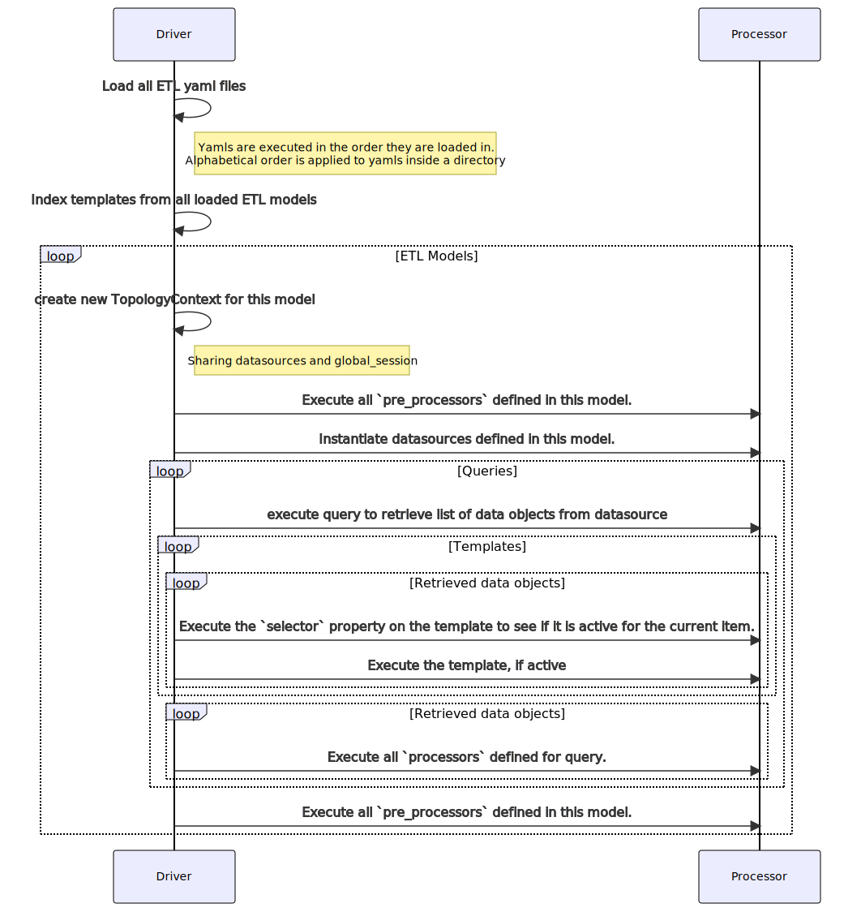

# StackState ETL

## Overview

StackState ETL is framework that enables the extraction and transformation of raw data from a target system
to the StackState 4T model using declarative low-code yaml templates.

The framework offers the capability to load the transformed data to the StackState server with an out-of-the-box
[commandline utility](#commandline-utility) or by using the framework from a 
[StackState Agent Check]([https://docs.stackstate.com/develop/developer-guides/agent_check/agent_checks).
See [StackState ETL Agent Check](https://github.com/stackstate-lab/stackstate-etl-agent-check) for such an
implementation.

## TL;DR

If you learn faster by looking at examples, refer to 
[StackState Nutanxi Agent Check](https://github.com/stackstate-lab/sts-nutanix-agent-checks#template-mappings) for a 
real world example of using StackState ETL.

## Introduction

The framework uses a mix of yaml structures that can have dynamic expressions to derive the final values. The
[Concepts](#concepts) section will elaborate further on the structures and their purpose. First we need to be 
introduced to expressions and the context they are interpreted within.

### Expressions

Expressions take on the form of [Json Path](https://goessner.net/articles/JsonPath/index.html#e2) expressions or
Python Code expressions.

| Type     | Denotation | Comments                                             |
|----------|------------|------------------------------------------------------|
| JsonPath | '$.'       | Any yaml string value starting with                  |
| Python   | '&#124;'   | Any yaml string value starting with a pipe character |


Python expressions are evaluated using a minimal [Python AST Evaluator](https://newville.github.io/asteval/index.html),
while Json Path is evaluated using [jsonpath-ng](https://github.com/h2non/jsonpath-ng#jsonpath-syntax).

### Evaluation Context

StackState ETL makes available handy open-source libraies to help you with your transformations when using
Python expressions or code snippets. The context always has the following builtins available,

| Name              | Type                                                               | Description                                                       | 
|-------------------|--------------------------------------------------------------------|-------------------------------------------------------------------|
| factory           | [TopologyFactory](./docs/static/stackstate_etl/model/factory.html) | Registry for 4T elements                                          |
| jpath             | function                                                           | Accepts a json path expression to evaluate against current `item` |
| session           | dict                                                               | Dictionary that exists on within the current ETL definition       |
| global_session    | dict                                                               | Dictionary that exists across all ETL definitions                 |
| uid               | function                                                           | Used to create ids. See TopologyFactory.get_uid(...)              |
| datetime          | [datetime](https://docs.python.org/3/library/datetime.html)        | Module supplies classes for manipulating dates and times.         |
| pytz              | [pytz](https://pythonhosted.org/pytz/)                             | Library allows accurate and cross platform timezone calculations  |
| requests          | [requests](https://requests.readthedocs.io/en/latest/)             | Simple HTTP library                                               |
| pandas            | [pandas](https://pandas.pydata.org/)                               | Data analysis and manipulation tool                               |
| pendulum          | [pendulum](https://pendulum.eustace.io/)                           | Drop-in replacement for the standard datetime class               |
| pydash            | [pydash](https://pydash.readthedocs.io/en/latest/)                 | Utility libraries for doing “stuff” in a functional way.          |
| networkx          | [networkx](https://networkx.org/documentation/stable/index.html)   | Network analysis package                                          |
| log               | [Logger](https://docs.python.org/3/library/logging.html)           | Logging                                                           |
| `datasource name` | Any                                                                | Datasource instance as defined in ETL yaml                        |


Including the [builtins](https://newville.github.io/asteval/basics.html#built-in-functions) provided by asteval itself.

As the framework processes rows of data, temporary objects become available depending on current template being evaluated.


| Name              | Type                                                                                                          | Description                           | 
|-------------------|---------------------------------------------------------------------------------------------------------------|---------------------------------------|
| item              | dict                                                                                                          | Dict. Current row from extracted data |
| component         | [Compoment](./docs/static/stackstate_etl/model/stackstate.html#stackstate_etl.model.stackstate.Component)     | Optional                              |
| metric            | [Metric](./docs/static/stackstate_etl/model/stackstate.html#stackstate_etl.model.stackstate.Metric)           | Optional                              |
| event             | [Event](./docs/static/stackstate_etl/model/stackstate.html#stackstate_etl.model.stackstate.Event)             | Optional                              |
| health            | [Health](./docs/static/stackstate_etl/model/stackstate.html#stackstate_etl.model.stackstate.HealthCheckState) | Optional                              |

## Concepts

### Datasource

To extract data from a target system, one usually interacts with a target system's API via some sort of client library 
or SDK. Most moderen systems expose a Rest Api or GQL Api that can be interacted with generic libraries like
[requests](https://requests.readthedocs.io/en/latest/) or [gql](https://gql.readthedocs.io/en/latest/modules/client.html).

The framework allows for the declarative definition of a __Datasource__ to capture the above process.

```yaml
etl:
    datasources:
      - name: nutanix_client
        module: sts_nutanix_impl.client.nutanix_client
        cls: NutanixClient
        init: "NutanixClient(conf.nutanix, log)"
        
      - name: my_rest_client
        init: "requests.Session()"
        
      - name: my_static_client
        init: |
          def generate_data():
            return [{"hostA": 1, "calls": "hostB"}, {"hostB": 2}, {"hostC": 3}]
          generate_data
```

A datasource can reference any Python class that will be passed to the `init` code snippet for instantiation and 
configuration. Or the `init` can create the datasource using arbitrary code.

In the `my_rest_client` example, the `init` does not have to be prefixed with `|` as the framework already expects the
property to be code.  The last line of an expression is the value that is returned, note the `my_static_client` example
returns the function as the value.

Once the datasource is intrepreted, the datasource is available in the evalution context under the specified `name` 


### Query

Extracting data from a target system entails making requests to the target system for the desired data.

The framework allows for the declarative definition of a __Query__ to capture the above process.  

```yaml 
etl:
  queries:
    - name: nutanix_hosts
      query: "|my_static_client()"
      template_refs:
        - host_template
        - metric_template
```

The `query` can make use of a datasource to make a request. The result must always be a list of dictionary objects.
`template_refs` reference the names of templates that will process each item in the list to create 4T model elements.
Namely component, health, metric, event.  The framework will iterate the list and pass each item to the template via
the execution context under the variable `item`

#### Derived data sets using a processor

The list of items received from a datasource can sometimes contain other list that can lead to the creation or 
enhancement of 4T model elements.  In this case, a query can define a `processor`

```yaml
etl:
  queries:
    - name: nutanix_clusters
      query: "nutanix_client.get_clusters()"
      processor: |
        rackable_units = session.setdefault("rackable_units", {})
        rackable_units[item["uuid"]] = item["rackable_units"]
      template_refs:
        - nutanix_cluster_template
    - name: nutanix_rackable_units  
      query: |
        results = []
        for cluster, units in session["rackable_units"].items():
          [py_.set_(n, "cluster_uuid", cluster) for n in units]
          results.extend(units)
        results
      template_refs:
        - nutanix_rackable_unit_template
```

#### Processing item without using templates

The `processor` can also be used to process an item from the query directly. Using the `factory` to interact with 4T
elements.

```yaml
etl:
  queries:
    - name: snow_ci_relation_labels
      query: "snow_client.get_labels()"
      processor: |
        ctype, uid_func = session['type_lookup'][item['class']]
        cid = None
        if ctype == 'nutanix-vm' and not item['name'].startswith("NTNX"):
          cid = "urn:host:/%s" % item['name'].lower()
        else:
          cid = uid_func(item['name'])
        if cid is not None and factory.component_exists(cid):
          target_component = factory.get_component(cid)
          target_component.properties.labels.extend(item['labels'])
        else:
          log.error("Failed to lookup type '%s' with name '%s' and component id '%s'" % (ctype, item['name'], cid))
      template_refs: []
```

The above example illustrates using the result of a query to add labels to an existing component in the factory.

### Templates

Transforming data from a target system entails manipulation and mapping of the data to another form.
In StackState ETL the target form is Component, Event, Metric or Health 4T element.

The framework allows for the declarative definition of a __Template__ to capture the above process.

```yaml
etl:
  template:
    components:
      - name: name_of_template
        selector: "|item['class']=='disk'"
      ...
    health:
      ...
    metrics:
      ...
    events:
      ...
```

Every template must have a `name` property.  An optional `selector` expression can be set to indicate whether the 
template should be applied for the current `item` from the query. 


### Component Template

The foundational elements in the StackState [4T Model](https://docs.stackstate.com/use/concepts/4t_data_model) are
[Components](https://docs.stackstate.com/use/concepts/components) and [Relations](https://docs.stackstate.com/use/concepts/relations)

The component template offered by the framework allows for the definition of a componenent to be specified as a spec or
as a code snippet.

| Name        | Type    | Description                                                                                                                                  | 
|-------------|---------|----------------------------------------------------------------------------------------------------------------------------------------------|
| uid         | string  | Required.                                                                                                                                    |
| name        | string  | Required.                                                                                                                                    |
| type        | string  | Required. Except when `mergeable` property set.                                                                                              |
| layer       | string  | Optional. Defaults to global settings.                                                                                                       |
| domain      | string  | Optional. Defaults to global settings.                                                                                                       |
| environment | string  | Optional. Defaults to global settings.                                                                                                       |
| labels      | list    | Optional. Can also be a string expression that resolves to a list.                                                                           |
| identifiers | list    | Optional. Can also be a string expression that resolves to a list. `uid` is automatically added.                                             |
| relations   | list    | Optional. `id` or `name` reference to related component. Use pipe symbol to define relation type. Use '<' to reverse relation.               |
| processor   | code    | Optional. Process `component` object using code to set other properties.                                                                     |
| mergeable   | boolean | Optional. Allows component to be merged into an existing component. Or act as a placeholder until another template provides final component. |

#### Component Template Spec

```yaml
etl:
  template:
    components:
      - name: nutanix_disk_template
        spec:
          name: "$.disk_hardware_config.serial_number"
          type: "nutanix-disk"
          uid: "|uid('nutanix', 'disk',item['diskid'])"
          layer: "Nutanix Disks"
          domain: "Nutanix"
          # Note the < symbol to indicated relation reversal
          relations: ["|'<urn:nutanix:host:/%s' % item['node_uuid']"]
          labels:
            - "|'prism:%s' % [jpath('$.cluster_name')]"
          identifiers:
            - "|'urn:nutanix:disk:/%s' % [jpath('$.disk_name')]"
          custom_properties:
            disk_size: "$.disk_size"
            online: "$.online"
```

#### Component Template Code

Below is the `code` snippet version of the `spec` in the previous section.
```yaml
etl:
  template:
    components:
      - name: nutanix_disk_template
        code: |
          component.name = jpath("$.disk_hardware_config.serial_number")
          component.set_type("nutanix-disk")
          component.uid =  uid('nutanix', 'disk', item['diskid'])
          component.properties.layer = "Nutanix Disks"
          component.properties.domain = "Nutanix"
          # Note the < symbol to indicated relation reversal
          factory.add_component_relations(component, ['<urn:nutanix:host:/%s' % item['node_uuid']]
          component.properties.add_label_kv("prism", item['cluster_name'])
          component.properties.add_identifier('urn:nutanix:disk:/%s' % jpath('$.disk_name'))
          component.properties.add_property("disk_size", item["disk_size"])
          component.properties.add_property("online", jpath("$.online"))
```

#### Mergeable property

It may occur that component information can be derived from serveral queries. The framework allows a component 
to be created only once in the `factory`. This is to prevent common configuration errors. Instead the framework
allows contributors to a component.  These components are marked with the `mergeable` property set to true.

When the ETL processing comes to a final stage, the framework will check that there are not dangling components and
throw an error if found.

```yaml

etl:
  queries:
    - name: snow_ci_relations
      query: "snow_client.get('CI_Relationships')"
      template_refs:
        - snow_farm_to_host_template
  template:
    components:
      - name: snow_farm_to_host_template
        selector: "|item['class'] == 'Farm'"
        spec:
          mergeable: true
          name: "$.parent"
          uid: "|uid('nutanix', 'cluster', item['parent'])"
          relations:
            - "|'%s|based_on' % uid('nutanix', 'host', item['child'])"

```


### Metric Template

Metrics are sent to StackState using the [Agent Check Metrics Api](https://docs.stackstate.com/develop/developer-guides/agent_check/agent-check-api#metrics).

The metric template offered by the framework allows for the definition of a metric to be specified as a spec or
as a code snippet.

#### Metric Types

| Metric Type | Description                                                      | 
|-------------|------------------------------------------------------------------|
| gauge       | Sample a gauge metric                                            |
| count       | Sample a raw count metric                                        |
| rate        | Sample a point, with the rate calculated at the end of the check |
| increment   | Increment a counter metric                                       |
| decrement   | Decrement a counter metric                                       |
| histogram   | Sample a histogram metric                                        |
| historate   | Sample a histogram based on rate metrics                         |

#### Metric Properties

| Name        | Type    | Description                                                                                                                                  | 
|-------------|---------|----------------------------------------------------------------------------------------------------------------------------------------------|
| name        | string  | Required.                                                                                                                                    |
| metric_type | string  | Required.                                                                                                                                    |
| value       | string  | Required. Float as string                                                                                                                    |
| target_uid  | string  | Required. The component targeted by this metric                                                                                              |
| tags        | list    | Optional. Can also be a string expression that resolves to a list.                                                                           |

#### Metric Template Spec

Defining a single metric using a `spec`

```yaml
etl:
  queries:
    - name: nutanix_disks
      query: "nutanix_client.get(nutanix_client.V2, 'disks')['entities']"
      template_refs:
        - nutanix_disk_metric_spec_template
  template:
    metrics:
      - name: nutanix_disk_metric_spec_template
        spec:
          name: "storage.logical_usage_gb"
          metric_type: "gauge"
          value: "|global_session['bytesto'](item['usage_stats']['storage.logical_usage_bytes'], 'g')"
          target_uid: "|uid('nutanix', 'disk', item['disk_uuid'])"

```

#### Metric Template Code

In many cases, you will need to map several metrics from an `item`. The `code` option can be perfectly used for those
cases.

```yaml
etl:
  queries:
    - name: nutanix_disks
      query: "nutanix_client.get(nutanix_client.V2, 'disks')['entities']"
      template_refs:
        - nutanix_disk_metric_code_template
  template:
    metrics:
      - name: nutanix_disk_metric_code_template
        code: |
          component_uid = uid('nutanix','disk', item['disk_uuid'])
          bytesto = global_session['bytesto']
          usage_stats = item["usage_stats"]
          factory.add_metric_value("storage.capacity_gb", 
                                    bytesto(usage_stats["storage.capacity_bytes"], 'g'),
                                    target_uid=component_uid)
          factory.add_metric_value("storage.free_gb",
                                    bytesto(usage_stats["storage.free_bytes"], 'g'),
                                    target_uid=component_uid)
          factory.add_metric_value("storage.usage_gb",
                                    bytesto(usage_stats["storage.usage_bytes"], 'g'),
                                    target_uid=component_uid)
```

### Event Template

Events are sent to StackState using the [Agent Check Event Api](https://docs.stackstate.com/develop/developer-guides/agent_check/agent-check-api#events).

The event template offered by the framework allows for the definition of an event to be specified as a spec.

```yaml
etl:
  template:
    events:
      - name: sample_propery_changed_event
        spec:
          category: "Changes"
          event_type: "ElementPropertiesChanged"
          msg_title: "Host Patched"
          msg_text: "|'%s host was patched' % factory.get_component_by_name(item['name']).uid"
          source: "nutanix"
          source_links:
            - title: "see in nutanix"
              url: "|'https://%s/karbon/v1-beta.1/k8s/clusters/%s' % (nutanix_client.url, item['id'])"
          data:
            old:
              patch_version: "v.1.1.0"
            new:
              patch_version: "v.1.1.2"
          tags:
            - "etl:event"
```


#### Event Properties

| Name                | Type                    | Description                                                                                                                                  | 
|---------------------|-------------------------|----------------------------------------------------------------------------------------------------------------------------------------------|
| category            | string                  | Required. Valid values are Activities, Alerts, Anomalies, Changes, Others                                                                    |
| event_type          | string                  | Describes the event being sent. This should generally end with the suffix Event, for example ConfigurationChangedEvent, VersionChangedEvent. |
| msg_title           | string                  | Required. The title of the event.                                                                                                            |
| msg_text            | string                  | Required. The text body of the event. Can be markdown.                                                                                       |
| element_identifiers | list                    | These are used to bind the event to a topology element or elements.                                                                          |
| source_links        | list of EventSourceLink | Optional. A list of links related to the event, for example a dashboard or the event in the source system.                                   |
| source              | string                  | The name of the system from which the event originates, for example AWS, Kubernetes or JIRA                                                  |
| data                | dict                    | Optional. Can be string that evaluates to dict. A list of key/value details about the event, for example a configuration version             |
| tags                | list                    | Optional. Can be string that evalulates to list. A list of key/value tags to associate with the event.                                       |


### Health Template

Health is synchronized with StackState using the [Health-Synchronization](https://docs.stackstate.com/configure/health/health-synchronization) mechanism.

The health template offered by the framework allows for the definition of a heath sync state to be specified as a spec.

```yaml
etl:
  queries:
    - name: nutanix_disks
      query: "nutanix_client.get(nutanix_client.V2, 'disks')['entities']"
      template_refs:
        - nutanix_disk_online_template
  template:
    health:
      - name: nutanix_disk_online_template
        spec:
          check_id: "|'%s_online' % item['disk_uuid']"
          check_name: "DiskOnline"
          topo_identifier: "|uid('nutanix', 'disk', item['disk_uuid'])"
          health: "|'CLEAR' if item['online'] else 'WARNING'"
          message: "|'Disk Status is %s' % item['disk_status']"
```


#### Health Properties

| Name            | Type                    | Description                                                                                                                      | 
|-----------------|-------------------------|----------------------------------------------------------------------------------------------------------------------------------|
| check_id        | string                  | Required. Identifier for the check state in the external system                                                                  |
| check_name      | string                  | Required. Name of the external check state.                                                                                      |
| topo_identifier | string                  | Required. Used to bind the check state to a StackState topology element.                                                         |
| message         | string                  | Optional. Message to display in StackState UI. Data will be interpreted as markdown                                              |
| health          | string                  | Required. One of the following StackState Health state values: Clear, Deviating, Critical.                                       |


## Modularity 

Writing yaml definitions can become unmanageable if done in a single file.  When writing definitions in multiple files,
duplication can become an issue.  StackState ETL framework has a few mechanism's available to prevent these issues.  

### Refs

Multiple ETL definition files can easily be composed using `refs` target definitions can be in directories or in python
modules. Nested `refs` are allowed. ETL definitions are executed in the order they are loaded in.
When the ref points to a folder, alphabetical order is applied to yamls before loading.


```yaml
etl:
  refs:
    - "module_dir://sts_nutanix_impl.templates"
  ...
```

`refs` is a list of paths referencing other ETL definitions. The paths have the format of `<prefix>://<dir or file>`

| Prefix      | Description                                     |
|-------------|-------------------------------------------------|
| module_dir  | reads all yaml files from a python module       |
| module_file | reads yaml file from a python module            |
| file        | reads yaml file(s) from location on file system |

### Pre- and Post- Processors

At times you may need to define utility functions for use by templates, or you may want to process all
components in the factory after all queries in the ETL definition have been executed. Adding common labels for example.
Pre- / Post-processors can be used for these cases. Note that these are scoped to running only within
the ETL definition they are found in. Processors can use [Scopes](#scopes) to contribute functions.


```yaml
etl:
  ...
  pre_processors:
    - name: convert_bytes_function
      code: |
        def bytesto(bytes, to, bsize=1024):
            a = {'k' : 1, 'm': 2, 'g' : 3, 't' : 4, 'p' : 5, 'e' : 6 }
            r = float(bytes)
            for i in range(a[to]):
                r = r / bsize
            return(r)
        global_session["bytesto"] = bytesto
```

The example above shows a conversion function that can convert bytes to kilobytes, gigabytes, etc.
Any code expression can access this function to perform the conversion.

```yaml
value: "|global_session['bytesto'](item['usage_stats']['storage.logical_usage_bytes'], 'g')"
```

### Scopes

A `session` scope and a `global_session` scope is available. `session` is only valid with the ETL definition.


## ETL Execution Flow

The sequence diagram shows the basic execution logic for processing ETL definitions.




## Commandline Utility

### Installation
On your local machine setup a virtual environment
```bash
$ # Install virtual env
$ pip install virtualenv
$ virtualenv --version
$ # Create a virtual environment in a directory of your choosing 
$ cd project_folder
$ virtualenv venv
$ source venv/bin/activate
```

Now install the `stsetl` utility.

```bash
pip install https://github.com/stackstate-lab/stackstate-etl/releases/download/0.1.0/stackstate-etl-0.1.0.tar.gz
```

The `ststetl` command-line utility reads ETL yaml files specified in the `conf.yaml` and sends the resulting 4T elements
to StackState.

```bash
$ stsetl --help
Usage: stsetl [OPTIONS]

Options:
  -f, --conf  TEXT  Configuration yaml file
  --log-level TEXT  Log Level
  --dry-run         Dry run static topology creation
  --work-dir  TEXT  Set the current working directory
  --help            Show this message and exit.
```

### Configuration

Create a `conf.yaml` similar to the one below. Remember to change the `receiver_url` and `api_key`

```yaml

stackstate:
  receiver_url: https://<your stackstate server>/receiver
  api_key: xxxxx
  #  use as the source identifier and url in StackState integrations when creating a Custom Synchronzation instance.
  instance_type: stackstate_etl
  instance_url: stackstate_etl_demo
  health_sync:
    source_name: static_health
    stream_id: "static_health_topo"   # unique id representing this stream instance
    expiry_interval_seconds: 2592000  # 30 Days
    repeat_interval_seconds: 1800     # 30 Minutes
  internal_hostname: localhost

etl:
  refs:
    - "file://./templates"
```

Create a sample template and dry run to see resulting Components, Relations and Health
You can copy [sample_etl.yaml](./tests/sample_etl.yaml) to `./templates`

```bash
$ mkdir -p ./templates
$ curl -L https://raw.githubusercontent.com/stackstate-lab/stackstate-etl/master/tests/sample_etl.yaml -o ./template/sample_etl.yaml
$ stsetl --dry-run   
```

## Installation on Python 2.7

StackState Agent 2 supports python 2.7.  StackState ETL is transpiled to python 2.7 code.

From a shell on the agent machine run,

```bash 
/opt/stackstate-agent/embedded/bin/pip install https://github.com/stackstate-lab/stackstate-etl/releases/download/v0.1.0/stackstate-etl-py27-0.1.0.tar.gz
```


### Reference Documentation

See [reference](./docs/static/stackstate_etl/index.html)